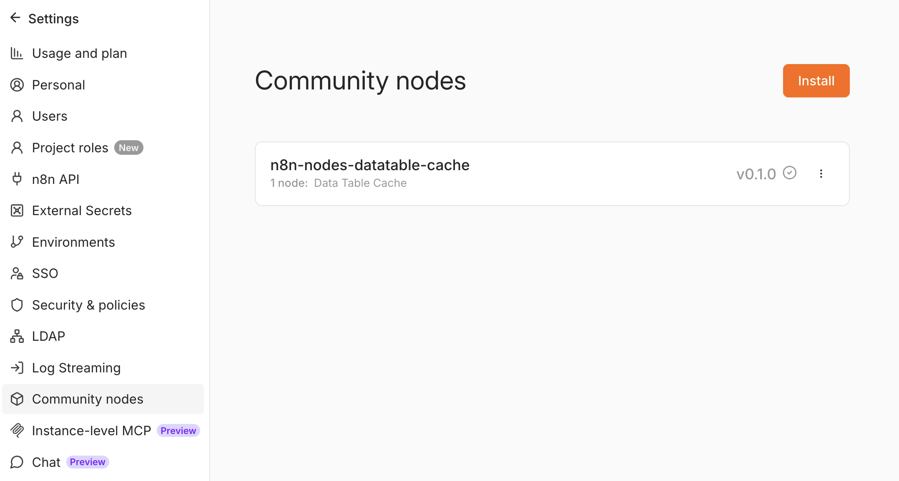
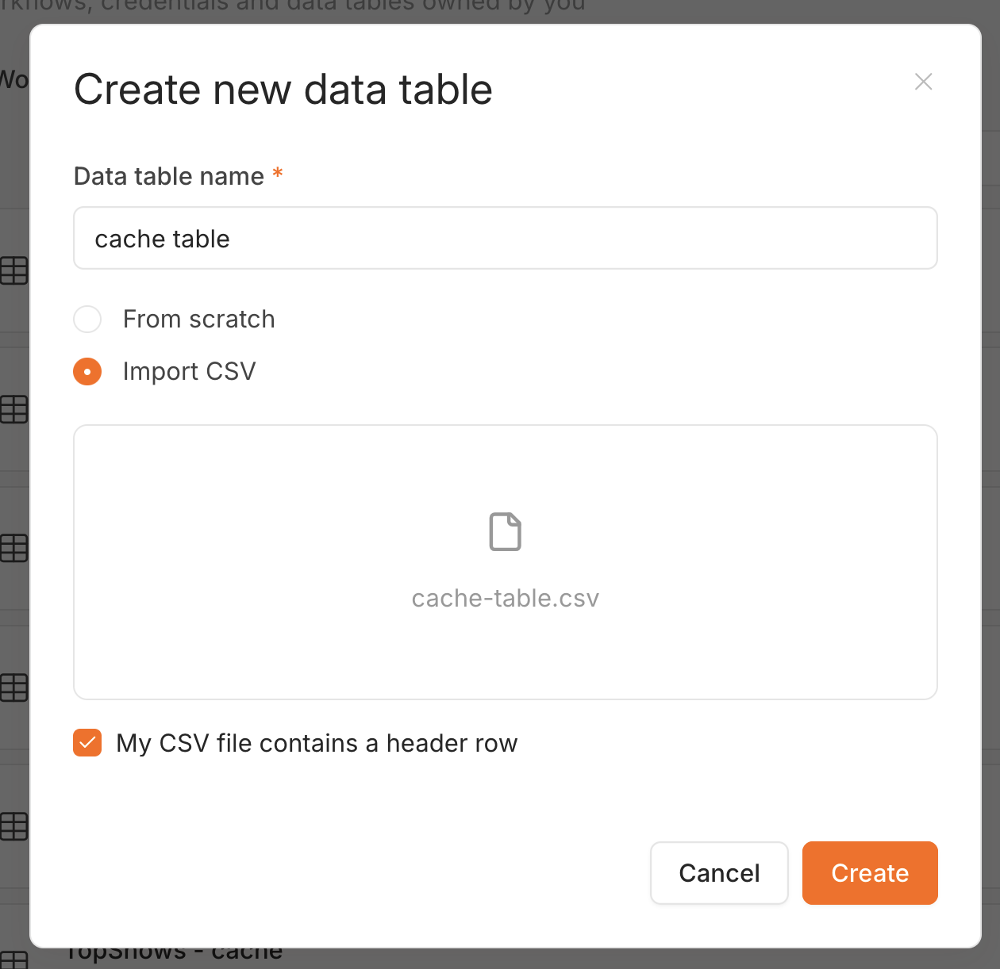
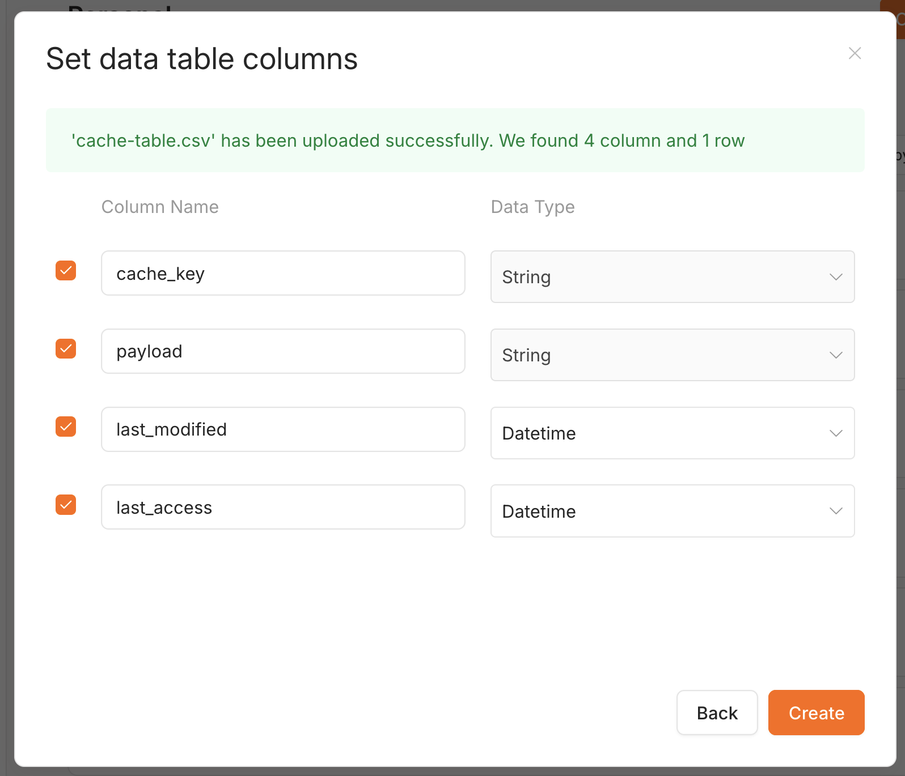
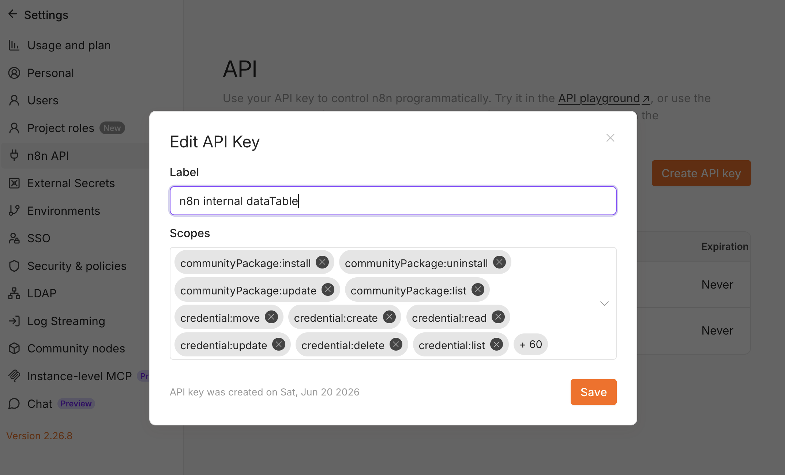
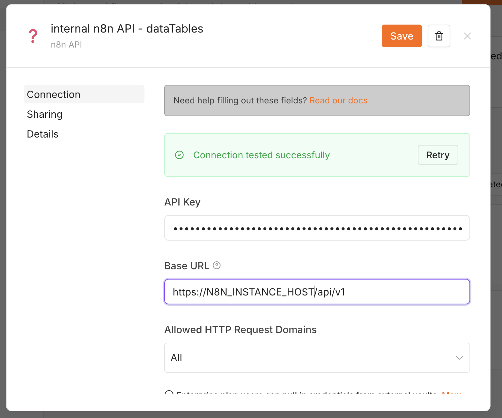

# Setup — one-time configuration

Do these four steps **once per n8n instance**. After that, you only touch the per-workflow
steps in the **[Usage guide](USAGE.md)**.

1. [Install the community node](#1-install-the-community-node)
2. [Create the cache data table](#2-create-the-cache-data-table)
3. [Create an n8n API key](#3-create-an-n8n-api-key)
4. [Create the n8n API credential](#4-create-the-n8n-api-credential)

---

## 1. Install the community node

**Settings → Community Nodes → Install** and enter `n8n-nodes-datatable-cache`.



You now have a **Data Table Cache** node available in the node panel.

---

## 2. Create the cache data table

The node stores each cached item as one row. The schema is four columns (n8n adds `id`,
`createdAt`, `updatedAt` automatically):

| Column          | Type                 | Required?    | Holds                                     |
| --------------- | -------------------- | ------------ | ----------------------------------------- |
| `cache_key`     | String               | Yes          | The lookup key (e.g. a record id, a hash) |
| `payload`       | String               | Yes          | `JSON.stringify` of the cached item       |
| `last_modified` | Datetime (or String) | Yes          | Timestamp of the last write — default TTL source |
| `last_access`   | Datetime (or String) | **Optional** | Timestamp of the last cache hit — only for idle TTL / LRU eviction |

> - **`payload` must be String.** A `json`-typed column breaks the `JSON.stringify` / `JSON.parse`
>   round-trip (hits come back as `{ "_raw": ... }`).
> - **Timestamps can be Datetime or String.** The node writes ISO-8601 UTC and reads it back as
>   UTC either way, so the TTL stays correct.
> - **`last_access` is optional.** A minimal table is just `cache_key` + `payload` +
>   `last_modified`. Add `last_access` only for **Measure From = Last Access** or idle-time eviction.

### Easiest: import the example CSV

Download **[`assets/cache-table.csv`](assets/cache-table.csv)** — its header row creates all four
columns for you:

```csv
cache_key,payload,last_modified,last_access
example-key,"{""value"":""hello"",""count"":42}",2026-06-20T12:00:00.000Z,2026-06-20T12:00:00.000Z
```

**Data tables → Create** → name the table → choose **Import CSV** → pick the file → keep
**"My CSV file contains a header row"** ticked → **Create**.



On the next screen, confirm the column types: **`cache_key` and `payload` = String**,
**`last_modified` and `last_access` = Datetime**. Then **Create**.



> Delete the seeded `example-key` row afterwards if you don't want it. To build the table by hand
> instead, choose **From scratch** and add the columns from the table above.

When the table is created, **copy its ID from the URL** — you'll paste it into the node later.

---

## 3. Create an n8n API key

The node reads and writes the data table through n8n's own API, so it needs an API key.

**Settings → n8n API → Create an API key.** Give the key these data-table scopes:
`dataTable:list`, `dataTableRow:read`, `dataTableRow:upsert`, `dataTableRow:update`.



Copy the key — you'll need it in the next step.

---

## 4. Create the n8n API credential

**Credentials → New → n8n API**:

- **API Key** — the key from step 3.
- **Base URL** — your instance URL **ending in `/api/v1`**, e.g.
  `https://your-n8n-host/api/v1`.

Click **Save**; you should see **"Connection tested successfully"**.



> A `404` when the node opens the **Data Table** list almost always means the Base URL is missing
> `/api/v1`, or your n8n version predates the public `/api/v1/data-tables` API. See
> [Troubleshooting](USAGE.md#troubleshooting).

---

✅ Setup done. Continue to the **[Usage guide](USAGE.md)** to wire the node into a workflow.
