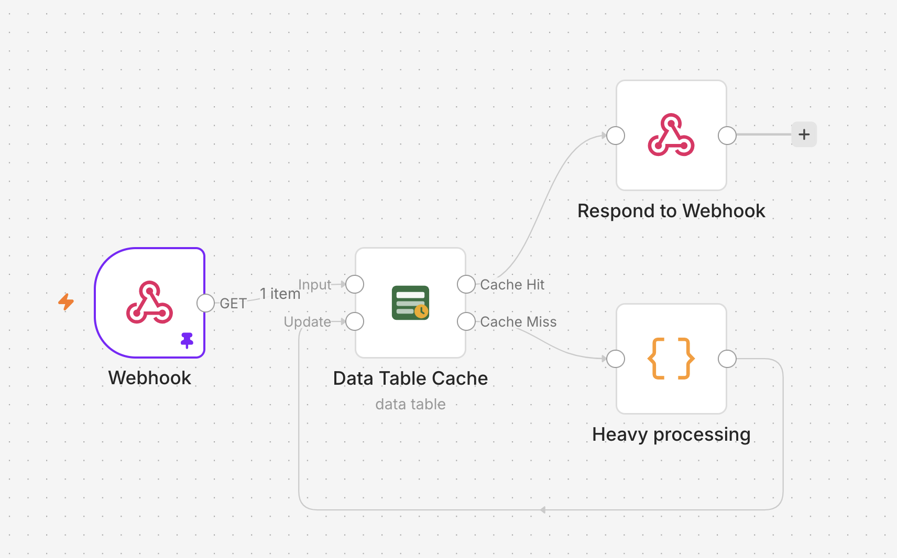
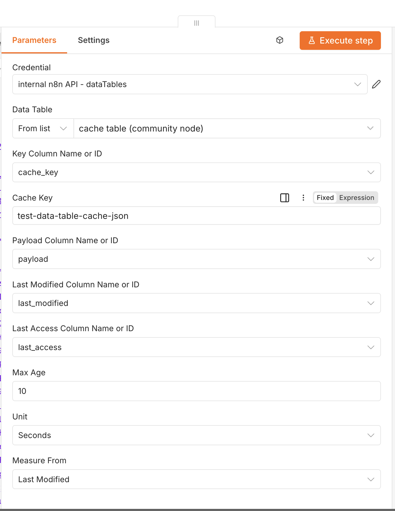

# Usage guide — using the cache in a workflow

> First time here? Do the one-time **[Setup](SETUP.md)** (install the node, create the data
> table, API key, and credential) before following this guide.

This guide covers everything you repeat **per workflow**: importing the example, configuring the
node, wiring the cache loop, tuning TTL, and keeping the table pruned.

1. [Import the example workflow](#1-import-the-example-workflow)
2. [Configure the node](#2-configure-the-node)
3. [How the wiring works](#3-how-the-wiring-works)
4. [TTL & expiry](#4-ttl--expiry)
5. [Maintenance — evict expired rows](#5-maintenance--evict-expired-rows)
6. [Key-design tips](#6-key-design-tips)
7. [Troubleshooting](#troubleshooting)

---

## 1. Import the example workflow

Import **[`assets/example-workflow.json`](assets/example-workflow.json)** via
**Workflows → Import from File**. It demonstrates the full read-through / write-back loop:



```
Webhook ─▶ [Input] Data Table Cache [Cache Hit] ─▶ Respond to Webhook
                                    [Cache Miss] ─▶ Heavy processing
                                                          │
                        [Update] ◀────────────────────────┘
```

> If import errors with *"unknown node type"*, you skipped [Setup step 1](SETUP.md#1-install-the-community-node) —
> install the community node and reload.

---

## 2. Configure the node

Open the **Data Table Cache** node and set:

- **Credential** — the **n8n API** credential from [Setup step 4](SETUP.md#4-create-the-n8n-api-credential).
- **Data Table** — pick your table from the list (or paste its ID over `REPLACE_WITH_TABLE_ID`).
- **Cache Key** — the value to look up / store under. Derive it from a field present on both the
  lookup item and the processed item, e.g. `={{ $json.query.key }}`.

The column names default to `cache_key`, `payload`, `last_modified`, `last_access` — matching the
table from setup, so you normally leave them as-is.



| Parameter            | Default         | Notes                                                |
| -------------------- | --------------- | ---------------------------------------------------- |
| Data Table           | —               | Pick from list or enter the table ID                 |
| Key Column           | `cache_key`     | Column matched against the cache key                 |
| Cache Key            | —               | Value to look up (Input) or store under (Update)     |
| Payload Column       | `payload`       | Holds the JSON-stringified payload                   |
| Last Modified Column | `last_modified` | Timestamp of the last write                          |
| Last Access Column   | `last_access`   | Timestamp of the last hit (optional; leave empty to skip) |
| Max Age + Unit       | `3600` s        | A hit older than this becomes a miss                 |
| Measure From         | `Last Modified` | Whether TTL counts from `last_modified` or `last_access` |

---

## 3. How the wiring works

The node has **two inputs** and **two outputs**:

- **Input** (input 1) receives items to look up.
- **Cache Hit** (output 1) carries the payload — both fresh hits and items that were just
  stored — so it's your "continue with the data" path.
- **Cache Miss** (output 2) carries items that need work. Wire it through your processing and
  back into **Update** (input 2).
- **Update** (input 2) upserts the processed item and re-emits it on **Cache Hit**.

So the loop is: **Cache Miss → your work → Update input**; take **Cache Hit** onward. Requires
`executionOrder: v1` (the default on recent n8n).

> **One item = one JSON object, not an array.** n8n passes items individually, so the **Update**
> input stores a single item's `$json` per cache key, and **Cache Hit** emits that same single
> JSON object. To cache a collection under one key, wrap it in an object first
> (e.g. `{ "items": [...] }`) so it travels as a single item.

---

## 4. TTL & expiry

- **Max Age + Unit** — how long a hit stays fresh. Older hits route to **Cache Miss**.
- **Measure From**:
  - `Last Modified` — time since the value was cached (most caches want this). The default;
    needs no `last_access` column.
  - `Last Access` — time since it was last read; combine with a scheduled eviction job for
    LRU-style eviction. **Requires the Last Access Column** to be set (the node errors if it isn't).
- Expired lookups attach the stale row under `_staleRow` on the miss item, for debugging or
  serve-stale-on-error patterns.

---

## 5. Maintenance — evict expired rows

Data tables don't auto-delete expired rows, so the table grows until you prune it. Do this with a
separate, scheduled n8n **Data Table** node pointed at the same cache table — no API key or extra
scopes required:

- **Schedule Trigger** → **Data Table** node (operation **Delete Rows**) over the cache table.
- Filter on `last_modified` **less than** a cutoff, e.g.
  `={{ $now.minus({ days: 7 }).toUTC().toISO() }}`. Because timestamps are ISO-8601, a less-than
  comparison sorts them chronologically.
- To evict by idle time instead, filter on `last_access`.

> Keep payloads compact — all data tables in an instance share a default **50 MB** limit
> (`N8N_DATA_TABLES_MAX_SIZE_BYTES` to raise it on self-hosted).

---

## 6. Key-design tips

- Make the key **deterministic** for the same logical request (sort/normalise inputs before
  hashing). Hash long or structured keys, e.g. `={{ $json.url.toLowerCase() }}`.
- Use **one table per cache** (or prefix keys with a namespace) so unrelated caches don't collide
  and can be pruned independently.
- Concurrency is **last-write-wins** — fine for a cache, not for transactional data.

---

## Troubleshooting

| Symptom                                       | Likely cause / fix                                                              |
| --------------------------------------------- | ------------------------------------------------------------------------------- |
| `404` opening the Data Table list             | Base URL missing `/api/v1`; or n8n too old for `/api/v1/data-tables` (see below) |
| `404` on both `/workflows` and `/data-tables` | Base URL is wrong — must end in `/api/v1`                                        |
| `/workflows` 200 but `/data-tables` 404       | Your n8n build predates the public data-table API — upgrade n8n                  |
| `403`                                         | API key is missing the required `dataTable*` scopes                              |
| Hits always come back as `{ "_raw": ... }`    | `payload` column isn't String, or rows were written outside this node            |
| Import error *"unknown node type"*            | The community node isn't installed — see [Setup step 1](SETUP.md#1-install-the-community-node) |

Reproduce the API check directly:

```bash
curl -s -o /dev/null -w "workflows:   %{http_code}\n" -H "X-N8N-API-KEY: $N8N_API_KEY" "$N8N_BASE_URL/workflows?limit=1"
curl -s -o /dev/null -w "data-tables: %{http_code}\n" -H "X-N8N-API-KEY: $N8N_API_KEY" "$N8N_BASE_URL/data-tables?limit=1"
```

For verbose node logs, set `N8N_LOG_LEVEL=debug` — the node logs every request URL and the full
URL + status on failure (visible via `docker logs <container>`).
